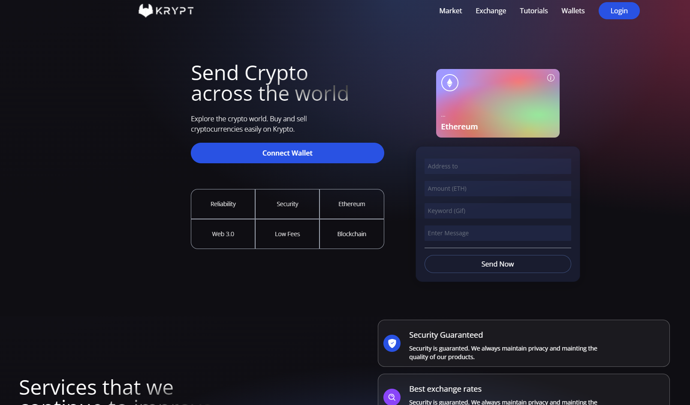

<p align="center">
  
</p>

<p align="center">
  

  

  
  <a href="https://github.com/DevJPVR/Web3.0/commits/master">
    
  </a>
    
   
   <a href="https://github.com/DevJPVR/Web3.0/blob/main/LICENSE">


  <a href="#">
    
  </a>
  

 
</p>


<h1 align="center">
    
</h1>


<br>

## 🧪 Tecnologias e recursos utilizados no projeto

Esse projeto foi desenvolvido com as seguintes tecnologias e recursos:

- [React](https://reactjs.org)
- [Vite](https://vitejs.dev/)
- [Tailwind](https://tailwindcss.com/)
- [Solidity](https://docs.soliditylang.org/)
- [Metamask](https://metamask.io/)
- [Alchemy](https://www.alchemy.com/)
- [Giphy](https://www.alchemy.com/)


## 🚀 Como executar

Clone o projeto e acesse a pasta do mesmo.

```bash
$ git clone https://github.com/DevJPVR/web3.0.git
```

Para iniciá-lo, siga os passos abaixo:
```bash
# Instalar as dependências
$ yarn
# Iniciar o projeto
$ yarn start
```
O app estará disponível no seu browser pelo endereço http://localhost:3000.


## 💻 Projeto

Ao conectar a sua wallet com a aplicação, é possivel visualizar as ultimas transações efetuadas, e enviar valores através da rede Ethereum na blockchain. Ao enviar os valores, é possivel escrever uma palavra chave no campo Keyword (GIF), através da API da Giphy a palavra chave é associada a um gif semelhante , e entao é exebida no cartão de transações. é possivel tambem enviar uma mensagem com a descrição do envio.

- [Link para testar a APP](https://dazzling-mcclintock-61dab6.netlify.app/)


## 📝 License

Esse projeto está sob a licença MIT. Veja o arquivo [LICENSE](https://github.com/DevJPVR/web3.0/blob/main/LICENSE) para mais detalhes.

---

Feito com 💜 by JoãoPedro
